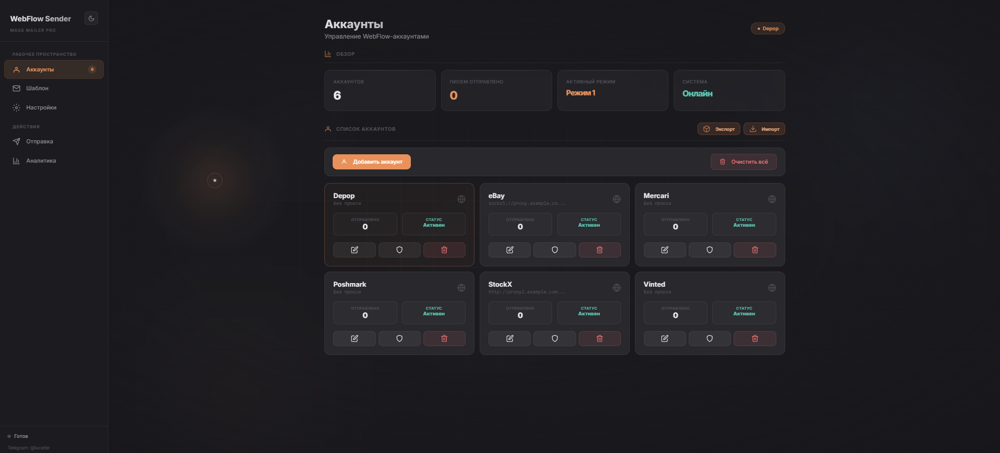
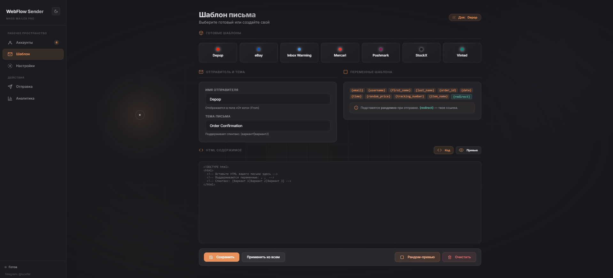
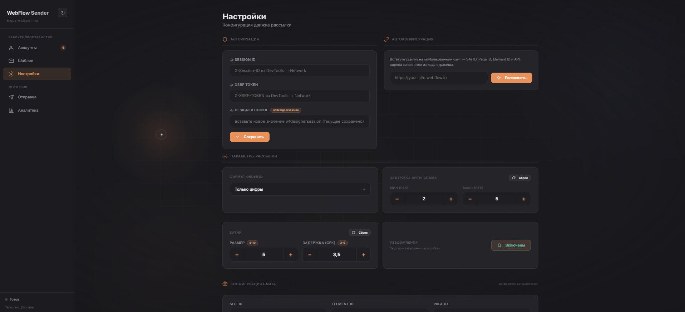
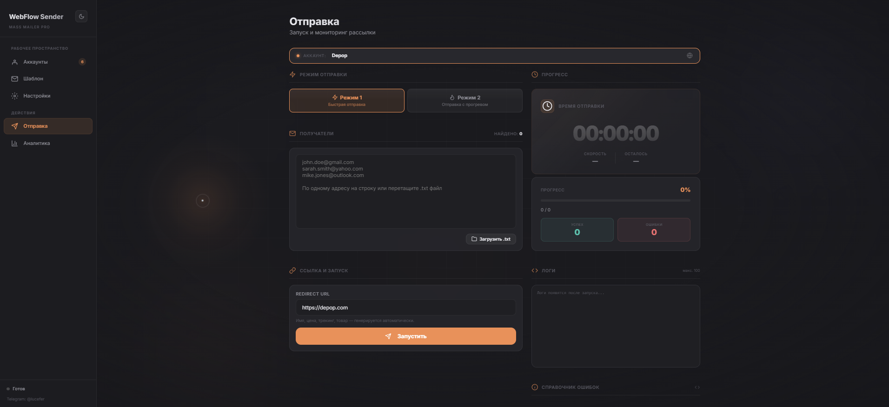
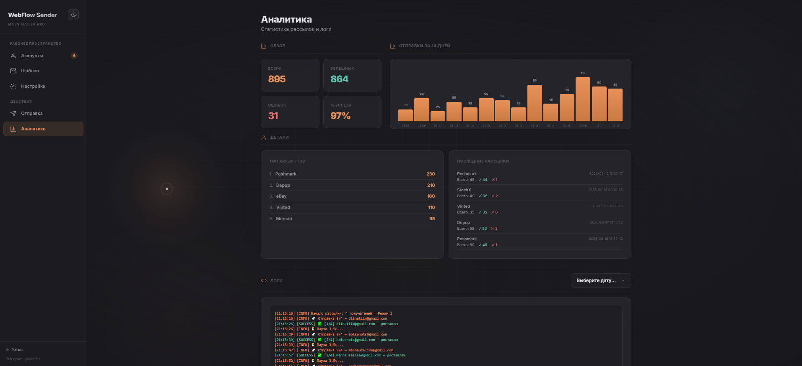

> [English](README.md) | **Русский**

<h1 align="center">WebFlow Sender</h1>

<p align="center">
  <strong>Высокопроизводительный движок email-рассылки на базе инфраструктуры форм Webflow</strong>
</p>

<p align="center">
  
  
  
  
</p>

<p align="center">
  
  
  
  
  
</p>

Вместо традиционных ESP (Mailchimp, SendGrid и т.д.) система программно обновляет настройки формы, публикует сайт и отправляет форму через Webflow Designer API — превращая любой сайт Webflow в полностью управляемый email-отправщик.

Включает современную SPA-панель с тёмной/светлой темой для управления аккаунтами, шаблонами, настройками и аналитикой рассылок в реальном времени.

> [!WARNING]
> Данный инструмент предоставлен исключительно в образовательных целях и для авторизованного тестирования. Автор не несёт ответственности за любое неправомерное использование. Всегда соблюдайте применимое законодательство и условия использования платформ.

---

## Содержание

- [Ключевые возможности](#ключевые-возможности)
- [Архитектура](#архитектура)
- [Технологический стек](#технологический-стек)
- [Начало работы](#начало-работы)
- [Конфигурация](#конфигурация)
- [Структура проекта](#структура-проекта)
- [Шаблонизатор](#шаблонизатор)
- [Режимы отправки](#режимы-отправки)
- [API Reference](#api-reference)
- [Скриншоты](#скриншоты)
- [Лицензия](#лицензия)

---

## Ключевые возможности

**Движок**
- Автоматизированный пайплайн: обновление настроек формы Webflow → публикация сайта → отправка формы
- Уникализация шаблона для каждого получателя (индивидуальное разрешение спинтакса, HTML-фингерпринт и подстановка переменных)
- Автоматический повтор с экспоненциальной задержкой при 429 rate limit (15с → 30с → 60с, до 3 попыток)
- Настраиваемые задержки между батчами и паузы между сообщениями

**Мульти-аккаунт**
- Неограниченное количество профилей Webflow с независимыми `session_id` / `xsrf_token`
- Поддержка прокси для каждого аккаунта (SOCKS5, HTTP) со встроенной проверкой через `api.ipify.org`
- Индивидуальные настройки имени отправителя, темы, шаблона и URL редиректа

**Система шаблонов**
- 7 готовых шаблонов: Depop, eBay, Poshmark, Vinted, Mercari, StockX, Inbox Warming
- Спинтакс-процессор с поддержкой вложенного синтаксиса и защитой MSO-блоков
- 11 динамических переменных: `{email}`, `{username}`, `{first_name}`, `{last_name}`, `{order_id}`, `{redirect}`, `{date}`, `{time}`, `{random_price}`, `{tracking_number}`, `{item_name}`
- Слой уникализации HTML: случайные комментарии между `</tr>`, атрибуты `data-mid`, невидимые прехедер-блоки

**Панель управления (SPA)**
- Интерфейс с пятью вкладками: Аккаунты, Шаблон, Настройки, Отправка, Аналитика
- Тёмная / Светлая тема с анимированным круговым переходом
- Автоконфигурация по URL Webflow — вставьте ссылку, получите Site ID, домен и все API-эндпоинты автоматически
- Редактор шаблонов Код / Превью с live-превью через Shadow DOM (inline + полноэкранный)
- Отслеживание прогресса в реальном времени: таймер, скорость, ETA, лог по каждому письму
- 14-дневный график аналитики, рейтинг аккаунтов, просмотр исторических логов
- Drag-and-drop импорт `.txt` файлов со списком получателей
- Полный экспорт / импорт аккаунтов, настроек и конфига в один JSON
- Звуковые уведомления на все UI-события (тосты) и завершение рассылки
- Кастомный курсор с магнитным hover-эффектом
- Кастомные скроллбары, цвета выделения текста и сворачиваемые секции UI
- Горячие клавиши: `Ctrl+S` (сохранить), `Ctrl+Enter` (начать отправку), `Esc` (закрыть модалку)

---

## Архитектура

```
┌────────────────────────────────────────────────────────────┐
│                     Browser (SPA)                          │
│  index.html + script.js                                    │
│  Tabs: Accounts │ Template │ Settings │ Send │ Analytics   │
└──────────────────────┬─────────────────────────────────────┘
                       │  REST API (JSON)
                       ▼
┌──────────────────────────────────────────────────────────────┐
│                   Flask Backend (app.py)                      │
│                                                              │
│  ┌──────────────┐  ┌──────────────┐  ┌───────────────────┐  │
│  │  Accounts    │  │  Settings    │  │  Analytics        │  │
│  │  CRUD + Sync │  │  Load/Save   │  │  Record + Query   │  │
│  └──────────────┘  └──────────────┘  └───────────────────┘  │
│                                                              │
│  ┌──────────────────────────────────────────────────────┐    │
│  │  Mailing Thread (per session)                        │    │
│  │  progress_data + stop_flag + logging                 │    │
│  └───────────────────────┬──────────────────────────────┘    │
└──────────────────────────┼───────────────────────────────────┘
                           │
                           ▼
┌──────────────────────────────────────────────────────────────┐
│              WebflowMailer (webflow_mailer.py)                │
│                                                              │
│  Для каждого получателя:                                     │
│    1. process_spintax(template)     — разрешить [a|b|c]      │
│    2. uniquify_html(template)       — фингерпринт HTML       │
│    3. _substitute_variables(tmpl)   — подставить {email}...  │
│    4. update_form_settings()        — POST настройки формы   │
│    5. publish_site()                — POST публикация        │
│    6. wait_for_publish()            — опрос статуса задачи   │
│    7. trigger_form_submission()     — POST отправка формы    │
│    8. sleep(batch_delay)                                     │
└──────────────────────────────────────────────────────────────┘
                           │
                           ▼
                   Webflow Designer API
          (настройки формы, публикация, отправка формы)
```

---

## Технологический стек

| Слой | Технология |
|------|------------|
| Бэкенд | Python 3.10+, Flask 3.x |
| HTTP-клиент | `requests` (с опциональным `requests[socks]` для SOCKS5-прокси) |
| Фронтенд | Vanilla JavaScript (ES6+), HTML5, CSS3 |
| Типографика | Google Fonts (Inter) |
| Хранение данных | JSON-файлы (config, cookies, accounts, settings, analytics) |
| Внешний API | Webflow Designer API (настройки формы, публикация сайта, отправка формы) |

---

## Начало работы

### Требования

- Python 3.10 или выше
- Аккаунт Webflow с доступом к Designer
- Сайт Webflow с настроенным элементом формы

### Установка

```bash
git clone https://github.com/YOUR_USERNAME/WebFlow-Sender.git
cd WebFlow-Sender
pip install -r requirements.txt
```

Для поддержки SOCKS5-прокси:

```bash
pip install "requests[socks]"
```

### Запуск

```bash
python app.py
```

Откройте `http://localhost:5000` в браузере.

Все конфигурационные файлы (`config.json`, `cookies.json`, `settings.json`, `analytics.json`) и директории данных (`accounts/`, `logs/`) создаются автоматически при первом запуске — ручная настройка не требуется.

---

## Конфигурация

### Быстрая настройка (рекомендуется)

1. Откройте панель управления → вкладка **Настройки**
2. Вставьте URL вашего Webflow-сайта (например, `https://your-site-xxxxx.webflow.io`) в поле **Автоконфигурация**
3. Введите **Session ID** и **XSRF Token** из DevTools браузера
4. Нажмите **Распознать** — Site ID, Element ID, домен и все API-эндпоинты заполнятся автоматически
5. Нажмите **Сохранить всё**

### Ручная настройка

Все учётные данные хранятся в `config.json` (в gitignore, создаётся автоматически при первом запуске).

| Поле | Описание | Где найти |
|------|----------|-----------|
| `site_id` | Идентификатор сайта Webflow | Автоопределение из URL или Designer URL |
| `element_id` | ID элемента формы | Автоопределение через Webflow API |
| `page_id` | Страница с формой | Совпадает с `site_id` для одностраничных сайтов |
| `session_id` | Токен сессии | DevTools → Network → Request Headers (`x-session-id`) |
| `xsrf_token` | CSRF-токен | DevTools → Network → Request Headers (`x-xsrf-token`) |
| `domain` | Домен опубликованного сайта | например, `your-site.webflow.io` |
| `batch_delay` | Задержка между письмами (секунды) | В UI или config |
| `redirect_url` | Целевой URL для переменной `{redirect}` | В UI для каждого аккаунта |

Токены также можно управлять через панель управления (вкладка Настройки) и синхронизировать по аккаунтам.

---

## Структура проекта

```
WebFlow-Sender/
├── app.py                        # Flask-приложение — маршруты, API, оркестрация рассылки
├── webflow_mailer.py             # Основной движок — Webflow API, спинтакс, уникализация
├── requirements.txt              # Python-зависимости
├── LICENSE                       # MIT License
├── README.md                     # Документация (English)
├── README.ru.md                  # Документация (Русский)
│
├── static/
│   ├── script.js                 # Фронтенд-логика (аккаунты, шаблоны, отправка, аналитика)
│   └── Nota.mp3                  # Звук уведомления
│
├── templates/
│   ├── index.html                # SPA-панель управления (одностраничное приложение)
│   ├── template.txt              # Базовый шаблон письма
│   ├── template_depop.txt        # Depop — подтверждение заказа
│   ├── template_ebay.txt         # eBay — подтверждение заказа
│   ├── template_poshmark.txt     # Poshmark — уведомление о продаже
│   ├── template_vinted.txt       # Vinted — подтверждение заказа
│   ├── template_mercari.txt      # Mercari — уведомление о продаже
│   ├── template_stockx.txt       # StockX — подтверждение заказа
│   └── template_inbox.txt        # Inbox warming — уведомление
│
├── accounts/                     # Профили аккаунтов (gitignored, создаётся автоматически)
│   └── account_*.json
│
├── logs/                         # Ежедневные лог-файлы (gitignored, создаётся автоматически)
│   └── YYYY-MM-DD.log
│
└── docs/screenshots/             # Скриншоты для README
    ├── dark/                     #   Скриншоты тёмной темы
    └── light/                    #   Скриншоты светлой темы
```

**Создаются автоматически при запуске** (gitignored):
- `config.json` — конфигурация движка и учётные данные
- `cookies.json` — cookies сессии Webflow Designer
- `settings.json` — пользовательские настройки (задержки, формат order ID)
- `analytics.json` — статистика рассылок

---

## Шаблонизатор

### Спинтакс

Рандомизация контента для каждого письма с помощью синтаксиса скобок:

```
Your [order|purchase|transaction] has been [confirmed|processed|completed].
```

Вложенный спинтакс поддерживается:

```
[Hello [friend|valued customer]|Hi there|Greetings]
```

MSO-блоки (`<!--[if mso]>...<![endif]-->`) автоматически исключаются из обработки спинтакса.

### Динамические переменные

| Переменная | Пример | Описание |
|------------|--------|----------|
| `{email}` | `john.smith@gmail.com` | Email-адрес получателя |
| `{username}` | `john.smith` | Локальная часть email |
| `{first_name}` | `James` | Случайное имя |
| `{last_name}` | `Williams` | Случайная фамилия |
| `{order_id}` | `48291057` | Случайный ID заказа (формат настраивается) |
| `{redirect}` | `https://...` | URL редиректа из настроек аккаунта |
| `{date}` | `Mar 18, 2026` | Текущая дата |
| `{time}` | `14:30` | Текущее время |
| `{random_price}` | `$149.99` | Случайная цена ($12.99–$299.99) |
| `{tracking_number}` | `1Z9400827364...` | Случайный трек-номер |
| `{item_name}` | `Jordan 1 Retro High OG` | Случайное название товара |

### Уникализация HTML

Каждое письмо получает уникальный HTML-фингерпринт для снижения корреляции спам-фильтров:
- Случайные HTML-комментарии между `</tr>` тегами
- Уникальный атрибут `data-mid` на первом `<table>`
- Невидимый прехедер `<div>` с рандомизированным контентом после `<body>`

---

## Режимы отправки

### Режим 1 — Стандартный

Одно письмо на получателя. Пайплайн: обновление формы → публикация → отправка.

### Режим 2 — Inbox Warming

Два письма на получателя: сначала шаблон inbox warming (общее уведомление), затем основной шаблон. Задержка между ними настраивается через `dual_mode_delay`.

Оба режима обрабатывают получателей индивидуально (не батчами) для обеспечения уникальной подстановки переменных в каждом письме.

---

## API Reference

Все эндпоинты обслуживаются Flask-бэкендом на `http://localhost:5000`.

<details>
<summary><strong>Аккаунты</strong></summary>

| Метод | Эндпоинт | Описание |
|-------|----------|----------|
| GET | `/api/accounts` | Список всех аккаунтов |
| GET | `/api/accounts/get?filename=...` | Получить один аккаунт |
| POST | `/api/accounts/save` | Создать или обновить аккаунт |
| POST | `/api/accounts/delete` | Удалить аккаунт |
| POST | `/api/accounts/delete-all` | Удалить все аккаунты |
| POST | `/api/accounts/rename` | Переименовать аккаунт |
| POST | `/api/accounts/update-proxy` | Обновить прокси аккаунта |
| POST | `/api/accounts/update-field` | Обновить отдельное поле |
| POST | `/api/accounts/sync-config` | Синхронизировать токены в config.json |

</details>

<details>
<summary><strong>Шаблоны</strong></summary>

| Метод | Эндпоинт | Описание |
|-------|----------|----------|
| GET | `/api/templates/list` | Список доступных файлов шаблонов |
| GET | `/api/templates/load-file?filename=...` | Загрузить содержимое файла шаблона |
| GET | `/api/template/load?account=...` | Загрузить текущий шаблон аккаунта |
| POST | `/api/template/save` | Сохранить шаблон в аккаунт |
| POST | `/api/template/set` | Массовая установка шаблона (текущий / все аккаунты) |
| GET | `/api/template/set-logs` | Статус операции установки шаблона |

</details>

<details>
<summary><strong>Отправка</strong></summary>

| Метод | Эндпоинт | Описание |
|-------|----------|----------|
| POST | `/api/send` | Начать рассылку (работает в фоновом потоке) |
| POST | `/api/stop` | Остановить текущую рассылку |
| GET | `/api/status` | Получить прогресс рассылки |

</details>

<details>
<summary><strong>Настройки и конфигурация</strong></summary>

| Метод | Эндпоинт | Описание |
|-------|----------|----------|
| GET | `/api/settings/load` | Загрузить пользовательские настройки |
| POST | `/api/settings/save` | Сохранить пользовательские настройки |
| GET | `/api/config/load` | Загрузить конфигурацию движка |
| POST | `/api/config/save` | Сохранить конфигурацию движка |
| POST | `/api/config/parse-url` | Автоопределение конфигурации по URL Webflow |
| GET | `/api/random-vars?account=...` | Сгенерировать превью переменных |
| POST | `/api/redirect/set` | Установить URL редиректа для всех аккаунтов |
| POST | `/api/proxy/test` | Тест подключения прокси |

</details>

<details>
<summary><strong>Аналитика и логи</strong></summary>

| Метод | Эндпоинт | Описание |
|-------|----------|----------|
| GET | `/api/analytics/data` | Получить все записи аналитики |
| GET | `/api/logs/list` | Список доступных лог-файлов |
| GET | `/api/logs/view?date=...` | Просмотр содержимого лог-файла |

</details>

---

## Скриншоты

<p align="center">
  <picture>
    <source media="(prefers-color-scheme: dark)" srcset="docs/screenshots/dark/accounts.png" />
    <source media="(prefers-color-scheme: light)" srcset="docs/screenshots/light/accounts.png" />
    
  </picture>
  <br><em>Управление аккаунтами — мульти-аккаунт с настройками прокси, экспорт/импорт</em>
</p>

<p align="center">
  <picture>
    <source media="(prefers-color-scheme: dark)" srcset="docs/screenshots/dark/template.png" />
    <source media="(prefers-color-scheme: light)" srcset="docs/screenshots/light/template.png" />
    
  </picture>
  <br><em>Редактор шаблонов — брендовые шаблоны, переключатель Код/Превью с Shadow DOM, имя отправителя</em>
</p>

<p align="center">
  <picture>
    <source media="(prefers-color-scheme: dark)" srcset="docs/screenshots/dark/settings.png" />
    <source media="(prefers-color-scheme: light)" srcset="docs/screenshots/light/settings.png" />
    
  </picture>
  <br><em>Настройки — автоконфигурация по URL, токены авторизации, скорость батчей, анти-спам задержки</em>
</p>

<p align="center">
  <picture>
    <source media="(prefers-color-scheme: dark)" srcset="docs/screenshots/dark/sending.png" />
    <source media="(prefers-color-scheme: light)" srcset="docs/screenshots/light/sending.png" />
    
  </picture>
  <br><em>Отправка — выбор режима, drag-and-drop получателей, live-таймер с ETA, сворачиваемый справочник ошибок</em>
</p>

<p align="center">
  <picture>
    <source media="(prefers-color-scheme: dark)" srcset="docs/screenshots/dark/analytics.png" />
    <source media="(prefers-color-scheme: light)" srcset="docs/screenshots/light/analytics.png" />
    
  </picture>
  <br><em>Аналитика — 14-дневный график доставки, топ аккаунтов, последние рассылки со статистикой успех/ошибки</em>
</p>

---

## Лицензия

MIT License — см. [LICENSE](LICENSE) для подробностей.

---

<p align="center">
  <sub>Собран на Flask + Vanilla JS — без фреймворков, без раздутых зависимостей</sub>
  <br>
  <a href="https://t.me/Iucefer">
    
  </a>
</p>

<p align="center">
  <code>webflow</code> · <code>email-sender</code> · <code>bulk-mailer</code> · <code>flask</code> · <code>spintax</code> · <code>python</code> · <code>dark-theme</code> · <code>spa</code> · <code>anti-spam</code>
</p>
